# portrait_classifier
The project seeks to identify Roman emperors from Roman imperial coin features.
# Table of Contents

- [Introduction](#introduction)
- [EDA](#eda)
- [Basic Model](#basic-model)
- [Transfer Learning](#transfer-learning)
- [Conclusion](#conclusion)
- [Future Plans](#future-plans)
- [Sources](#sources)
# Introduction

# EDA
* Unbalanced data
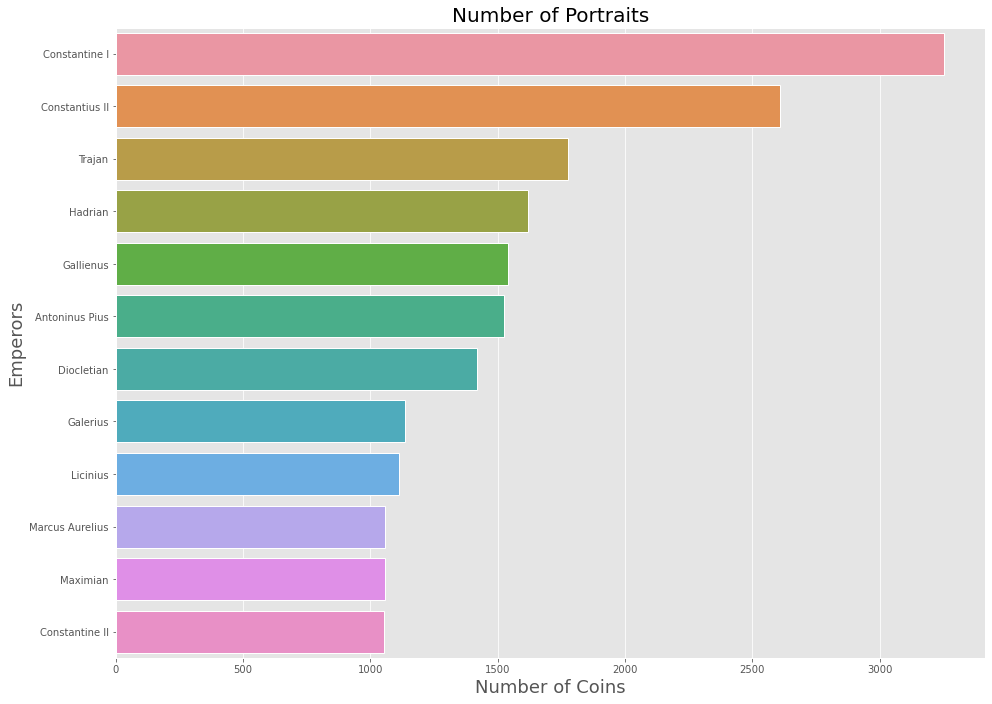
* EDA after balancing data

# Data manipulation

  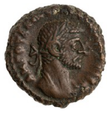
  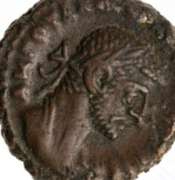
  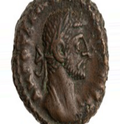 

# Basic Model

## Model architecture 

## Results

  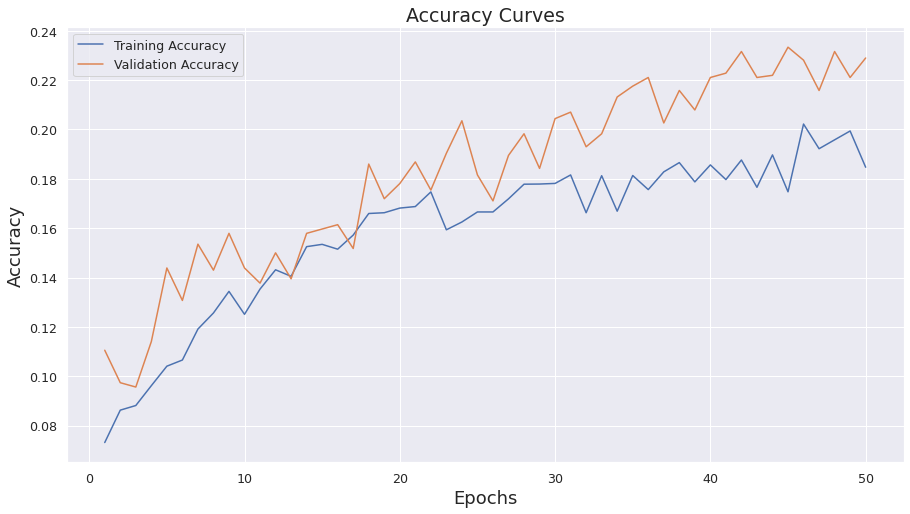
  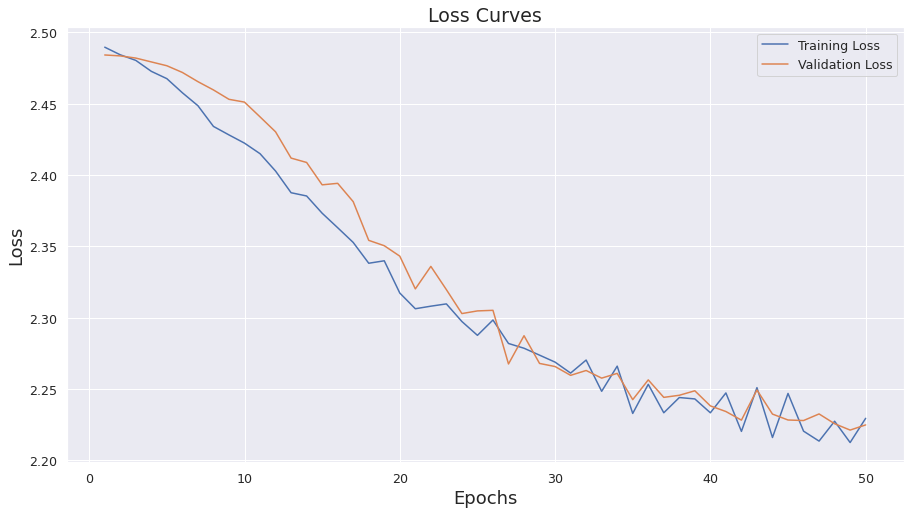 

# Transfer Learning Model (VGG-16)

## Model architecture

## Result

  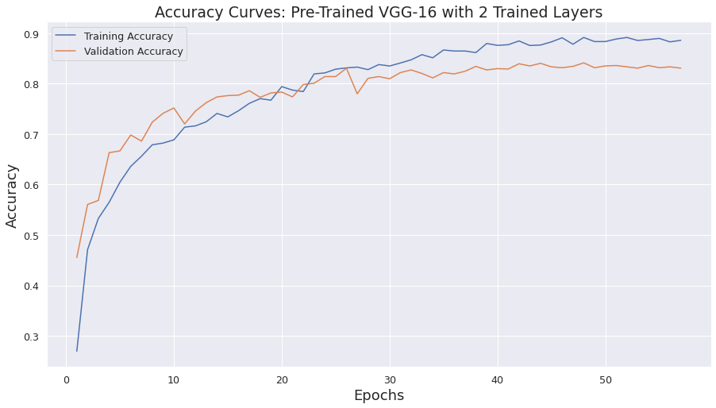
  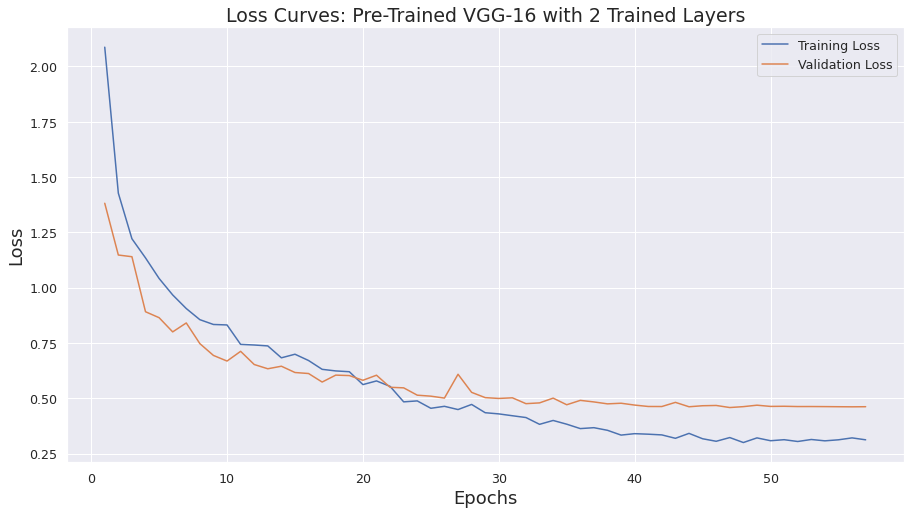 

# Conclusion

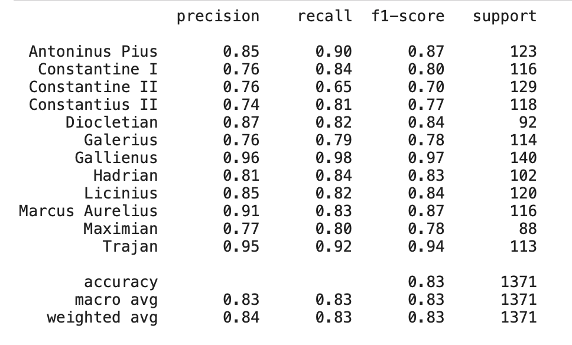

  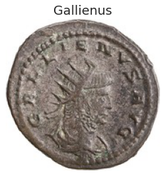
  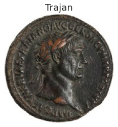 
  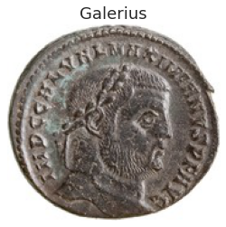

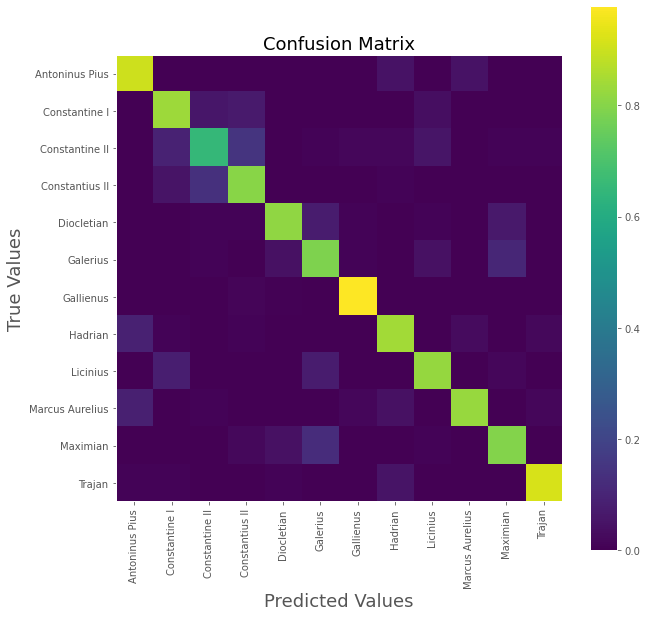

  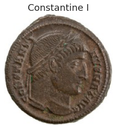
  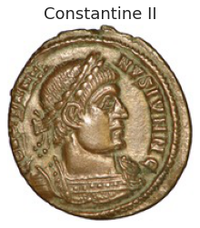 
  

# Future Plans
- Gray scale images to negate material differences, since the model picked up correlation among coins minted under the reign of Constantine I, Constantine II and Constantius II. 
- Use unbalanced data

# Sources
- http://numismatics.org
- https://core.ac.uk/download/pdf/110425364.pdf
