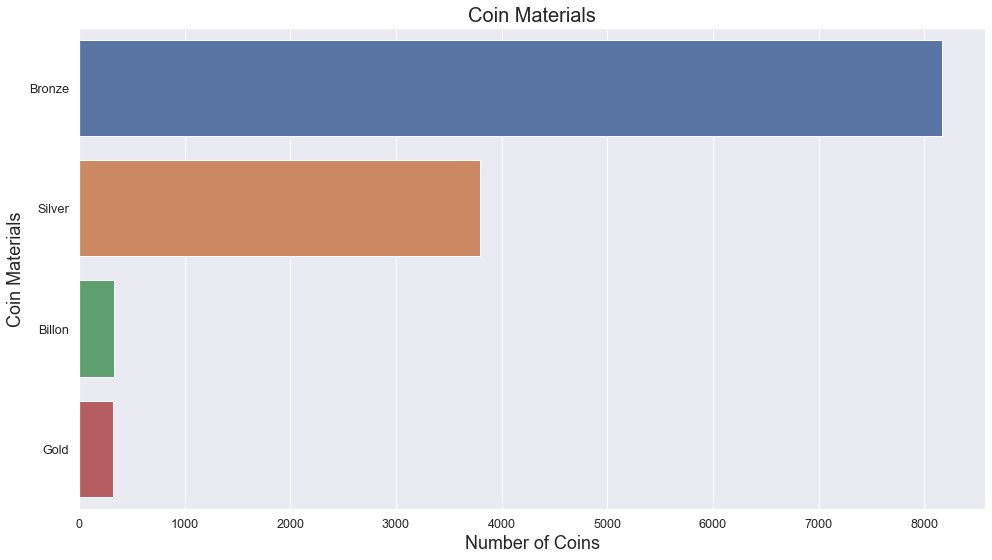
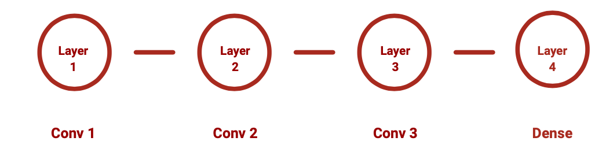
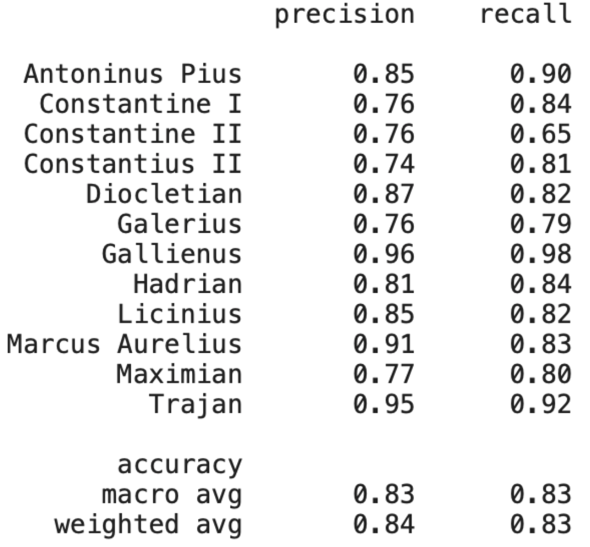
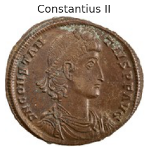

# Deep Learning Ancient Coins: Classifying Roman Coins with Convolutional Neural Networks
##### By: Jon Lee
## Table of Contents
- [Objective](#objective)
- [Introduction](#introduction)
  - [Background](#background)
  - [Data Collection and Preparation](#data-collection-and-preparation)
- [EDA](#eda)
  - [Exploring the Unbalanced Dataset](#exploring-the-unbalanced-dataset)
  - [Exploring the Balanced Dataset](#exploring-the-balanced-dataset)
  - [Data Manipulation](#data-manipulation)
  - [Assumptions](#assumptions)
- [My Model](#my-model)
  - [Model architecture](#model-architecture)
  - [Result](#result)
- [Transfer Learning](#transfer-learning)
  - [Transfer Model architecture](#transfer-model-architecture)
  - [Transfer Model Result](#transfer-model-result)
- [Conclusion](#conclusion)
  - [Interesting Point](#interesting-point)
- [Future Plans](#future-plans)
- [Technologies](#technologies)
- [Sources](#sources)

## Objective
This analysis seeks to utilize convolutional neural networking modeling (CNN) to classify images accurately. Additionally, it explores any commonalities among several coin clusters our naked eyes may miss during manual classification.

## Introduction
### Background
The Roman emperors viewed coins as an avenue to legitimize their authority and included their portrait. This tradition resulted in each emperors minting similar coins with drastically different facial features. However, the varying degree of materials and sheer number of years since being minted resulted in several coins being extremely difficult to recognize.

### Data Collection and Preparation
The images and metadata used for the analysis was sourced from numismatics.org. Each webpage from the website contains 20 images and URLs for each coin's metadata. For downloading a little over 45,000 images and extracting their metadata, I used Python's requests and Beautiful Soup libraries

When the script finished downloading and parsing data from the aforementioned website, I saved the parsed metadata into a JSON file as a backup file, while moving on to perform an exploratory data analysis.

## Exploratory Data Analysis
### Exploring the Unbalanced Dataset
The CNN models trained on an unbalanced dataset tend to favor dominant classes. As you can see below, Constantine I is represented with 3200 coins in our dataset. At the same time, some individuals, such as Tiberius Claudius Drusus, had a single coin with his portrait in the collected dataset. 

Furthermore, the dataset has many missing values. Out of 45,000 rows, the <b>years</b> column is missing 9500, while the <b>portraits</b> column, which represents the identity of the coin's portraiture, is missing about 1,000 columns. I imputed the missing years with the average year of the coins by each emperor. The missing values in the <b>portraits</b> was subsequently imputed from values from the <b>years</b> column.

Additionally, the dataset contains multiple names, such as 'Hadrian Divus', 'Divus Hadrian' and 'Hadrian', referring to the same person. Due to irregular nomenclature, the source had used for its coins, I manually set up a dictionary from which I leveraged Pandas's .replace() function to consolidate the data frame.

Since the CNN also requires large dataset to train before yieling reliable predictions, I proceeded to exclude emperors and others with less than 1,000 portraits. Eventually I had 12,000 images from 12 emperors to train CNN models. 

### Exploring the Balanced Dataset

Material-wise, the majority of the coins in the dataset is either Bronze or bronze alloy (Billon), with silver being a distant second material.

Chronologically, we see silver coin(Denarius) dominating the early years of the Roman Empire. The silver Denarii faded away as bronze coins (Antoninianus, AE1, AE2, AE3) start dominating the latter years.

## Data Manipulation
The CNN models benefit from a large dataset. However, balancing and splitting the dataset into training, validating and test datasets left me with about 1,000 images per emperor to train my model. To compensate for the small size of my trainable dataset, I decided to leverage Keras's image augmentation technique. I used Keras's ImageDataGenerator function to randomly flip, zoom in, zoom out, stretch compress and/or tilt before sending the processed images to the CNN model.

  
  
   

### Assumptions
With EDA and additional data manipulation complete, we now have a better understanding of the data we are going to use to train our CNN models. Specifically, there are two clear groups within the dataset - those that minted predominantly silver coins in the early years and those that printed bronze coins in the latter years. 

The CNN model, given the clear division of 2 clusters in the dataset, should capture correlation within each cluster of coins. At the same time, it should correctly classify one emperor from another, since each emperor has distinctive facial features.

## My Model

### Model architecture 

The model I built and tuned has a total of 3 layers with 'Relu' activation, and the last dense layer with 'softmax' activation. I selected its loss function to categorical cross-entropy and its optimizer stochastic gradient descent (SGD) with a learning rate of 0.005. The optimizer's learning rate would be halved every time its validation loss does not decrease by 0.01. Additionally, the model would stop training if the validation loss did not fall by 0.002 over 10 epochs. 

### Result

After training with 50 epochs, the training and validation accuracy and loss curves started to plateau around the 45th epoch. The curves indicate that training with 10,000 images, despite image augmentation, is not sufficient.

  
   

## Transfer Learning with VGG-16

### Transfer Model architecture

To overcome the issue above, I decided to leverage transfer learning, specifically a model called VGG-16 (VGG). The VGG is a model that has been pre-trained with over 45 million image datasets called imagenet with five layers of convolutional and max-pooling layers and a dense layer.  

From its 5 convolutional and max-pooling layers, I let the 5th layer to train with my coin images and replaced its default dense layer with a layer used on my model with a slight modification. Its loss function, activations, estimator, and parameters are identical to my model except the learning rate, which I set to 0.001 rather than 0.005.

### Transfer Model Result
After training for 50 epochs the model triggered the early stopping parameter with a final validation accuracy at around 82%.

  
   

## Conclusion
With the final validation accuracy reaching above 80%, I saved the trained model before testing it against the test set of images I did not use for the train/validation process.

When tested against a test data set, aforementioend VGG performed exceptionally well with an average accuracy of 83%, with the highest precision rate of 96% for one of the emperors, Gallienus.

  
   
  

The model produced the best precision and recall scores for Gallienus. Upon further review, Gallienus was the only one whose portrait was donning a "radiant crown" with spikes. The vast majority of coins for the remaining 11 emperors were wearing the more common "laurel wreaths.' As a result, the VGG was able to detect Gallienus' above feature and make highly accurate predictions.

Through confusion matrix, we can also notice correlation among contemporaries in the dataset. Specifically, Constantine I, Constantine II and Constantius II (father and 2 sons) displayed the most noticeable correlation in the above confusion matrix, followed by Antoninus Pius, Hadrian and Marcus Aurelius, who ruled in the late first to early second centuries. 

  
   
  

This proves the aforementioned assumption that the model is able to detect correlation from the 2 distinct cluster of rulers in the dataset.

## Future Plans
The VGG was highly effective in classifying images I trained on. However, I cannot determine whether the color of the coins or facial features had more effect on CNN's decision-making process. In the future, I would like to train the same model with gray-scaled images to examine the model's effectiveness without colors.

## Technologies
* Data collection and analysis packages: Python(Beautiful Soup, requests, pandas, matplotlib, seaborn), AWS
(EC2, S3, SageMaker)
* Deep learning packages: Tensorflow, Keras

## Sources and References
* http://numismatics.org
* https://core.ac.uk/download/pdf/110425364.pdf
